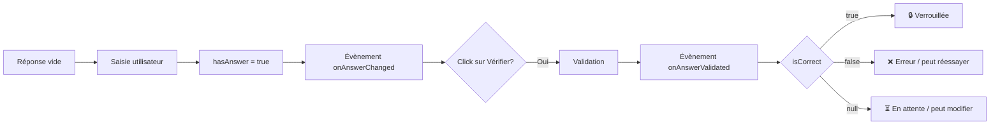

# 📋 Document officiel: Vue StudentWorkEditor
> **Version:** 2.1 | **Dernière mise à jour:** 22/04/2026 | **Auteur:** Référence technique

---

## 🎯 Objectif de la vue

`StudentWorkEditor` est le composant **SOURCE DE VÉRITÉ UNIQUE** pour toute la gestion des réponses étudiantes dans le projet.

✅ Rôles et responsabilités:
- ✅ Gestion native de **TOUS** les types de questions
- ✅ Validation automatique et semi-automatique
- ✅ Gestion des états des réponses
- ✅ Gestion du feedback utilisateur
- ✅ Cycle de vie complet des réponses
- ✅ API et évènements pour intégration avec les autres modules

❌ Ce composant **NE FAIT PAS**:
- ❌ Pas de sauvegarde (il émet seulement des évènements)
- ❌ Pas de gestion de la progression globale
- ❌ Pas de logique métier spécifique

---

## 🧩 Types de questions gérés

| Type de question | `correctionType` | Description |
|---|---|---|
| 🔵 Auto | `auto` | Correction 100% automatique (QCM, Select, Réponse courte) |
| 🟡 Semi | `semi` | Correction partiellement automatique |
| 🟠 Manuel | `manuel` | Correction 100% manuelle par le formateur |
| ⚫ Obligatoire | `obligatoire` | Réponse simple pour participation |

---

## 📊 Tableau de vérité officiel définitif

Ce tableau est la **règle absolue** à respecter en toute circonstance. Toute déviation est un bug.

| Type | Condition | Valeur `isCorrect` | Effet |
|---|---|---|---|
| ✅ `auto` | Réponse correcte | `true` | Question verrouillée, feedback vert ✅ |
| ✅ `auto` | Réponse incorrecte | `false` | Feedback rouge ❌, peut réessayer |
| ✅ `semi` + courte | Réponse dans la liste valide | `true` | Question verrouillée, feedback vert ✅ |
| ✅ `semi` + courte | Réponse pas dans la liste | `null` | Feedback jaune ⏳ en attente |
| ✅ `semi` + ouverte | `minLength` défini **ET** `0 < longueur < minLength` | `false` | Feedback rouge ❌ "Réponse trop courte" |
| ✅ `semi` + ouverte | longueur >= minLength | `null` | Feedback jaune ⏳ en attente |
| ✅ `semi` + ouverte | pas de limite définie | `null` | Feedback jaune ⏳ en attente |
| ✅ `manuel` | **TOUS LES CAS, QUEL QUE SOIT LA RÉPONSE** | `null` | Feedback bleu 📝 en attente |
| ✅ `obligatoire` | Réponse saisie | `true` | Points de participation |

---

## 🎚️ Comportement par mode

### 🟢 Mode Normal (défaut)
| Action | Comportement |
|---|---|
| Réponse saisie | Évènement `onAnswerChanged` |
| Clic sur Vérifier | Validation, évènement `onAnswerValidated` |
| `isCorrect = true` | Question verrouillée définitivement |
| `isCorrect = false` | Peut modifier et réessayer |
| `isCorrect = null` | Peut modifier indéfiniment |

### 🔵 Mode Examen
| Action | Comportement |
|---|---|
| Boutons "Vérifier" cachés | ✅ |
| Sauvegarde automatique en temps réel | ✅ |
| Pas de feedback pendant la saisie | ✅ |
| Tout est verrouillé après rendu | ✅ |

### 🥽 Mode Blind
| Action | Comportement |
|---|---|
| Boutons "Vérifier" cachés | ✅ |
| Réponse saisie | Enregistrée **en silence** : `onAnswerValidated` avec `isCorrect = null` et `points = 0` |
| Feedback | Aucun, ni à la saisie ni à la restauration (`restoreAllAnswers` sort avant l'affichage) |
| Rendu | `validateAllQuestions()` puis **bilan min/max** en modale (`ChapterBilan.showBlindBilan`) |
| Après confirmation | `_finalizeBlindSubmission` — rendu définitif, tout verrouillé |

> Le bilan min/max n'est pas une estimation optimiste : une question auto sans réponse ou fausse
> compte 0 dans les **deux** bornes, c'est définitif. Seules les questions manuelles ou semi avec une
> réponse réelle (et le seuil de caractères atteint, s'il y en a un) font monter la borne haute.

### 💰 Mode Millionnaire
| Action | Comportement |
|---|---|
| Boutons "Vérifier" visibles | ✅ — le mode se joue question par question |
| Réponse auto **fausse** | Modale de choix : **Recommencer** ou **Rendre la copie** |
| Recommencer | `_resetAutoQuestions()` — remet à zéro les questions auto **et semi**, conserve les manuelles, puis re-tire l'ordre |
| Retour sur le chapitre | **Pas de reprise** : la tentative en cours est effacée et l'ordre re-tiré, y compris après un simple rechargement |
| Ordre des questions | Tiré au sort **par défaut** si le chapitre est entièrement auto-corrigé |

> Le rechargement compte comme une nouvelle tentative : c'est ce qui empêche de « sauvegarder » une
> bonne série en quittant la page. Un bandeau prévient l'apprenant, sinon il croirait avoir perdu ses
> réponses par accident.

### 🧾 Mode Atelier AR
| Action | Comportement |
|---|---|
| Questions auto, courtes, QCM, sélection | Identique au mode Découverte |
| Question **ouverte + `manuel`** | Devient une **consigne** validée en main propre |
| Décoration du bloc | Ajoutée à l'affichage par `AtelierQuestion.init()`, jamais à la publication |
| Bouton « Vérifier » | Renommé « 💾 Enregistrer mon compte rendu », comportement inchangé |
| Compte rendu | Figé dès que l'apprenant a demandé la validation |
| Attribution des points | Par saisie de l'AR, qui promeut `arPoints` en `teacherScore` |
| Saisie de l'AR | **Reste active même chapitre verrouillé** — seule exception au verrouillage |

> `AtelierQuestion` ne modifie **jamais** le tableau de vérité : une consigne est une question `manuel`,
> donc `isCorrect` reste `null` et les points ne viennent que du formateur. Voir `mode atelier AR.md`.

### 🔴 Chapitre rendu / corrigé
| Action | Comportement |
|---|---|
| **TOUS** les champs sont verrouillés | ✅ |
| Aucune modification possible | ✅ |
| Feedback de correction visible | ✅ |
| Exception | Le champ de saisie de l'AR du mode Atelier reste utilisable |

---

## 🎛️ Options d'affichage, indépendantes du mode

Deux réglages de chapitre s'ajoutent au mode, cochés par le formateur dans le tableau de bord. Ils sont
stockés dans `slug:config:chapter_config` et ne touchent ni les réponses ni les scores : **seul l'ordre
et le découpage de l'affichage changent**.

| Option | Modes concernés | Condition | Défaut |
|---|---|---|---|
| 🎲 Ordre aléatoire | Examen, Blind, Millionnaire | Chapitre **entièrement auto-corrigé** | coché en Millionnaire, décoché ailleurs |
| 📄 Questions par questions | Examen, Blind | aucune | décoché |

**Ordre aléatoire** (`ChapterOrdre`) — questions déjà répondues d'abord, dans l'ordre où elles l'ont
été, puis les autres mélangées. Rien n'est mémorisé : l'ordre est recalculé à chaque affichage. Les
blocs de cours ne bougent pas. Les vues formateur gardent toujours l'ordre publié.

**Questions par questions** (`ChapterPagination`) — un écran = un élément, blocs de cours compris,
navigation libre dans les deux sens. À l'ouverture, on se place sur la première étape non faite. La
pagination s'efface dès que le chapitre est rendu ou verrouillé.

> La **source unique de vérité des cinq modes** est `src/js/core/getExamContext.js`. Le mode effectif
> d'un apprenant est **figé à son premier démarrage** (`frozenChapterMode`) : le formateur qui change
> le mode ensuite n'affecte que ceux qui n'ont pas commencé. Les deux options ci-dessus, elles, sont
> relues à chaque affichage.

---

## 📋 Champs mis en jeu

### 📥 Champs d'entrée
| Attribut HTML | Description |
|---|---|
| `data-question-id` | Identifiant unique de la question |
| `data-correction-type` | Type de correction (`auto`/`semi`/`manuel`) |
| `data-points` | Nombre de points de la question |
| `onclick` | Contient les paramètres de correction |

### 📤 Champs retournés par `checkQuestion()`
| Champ | Type | Valeurs possibles |
|---|---|---|
| `hasAnswer` | `boolean` | `true` si une réponse est saisie |
| `isCorrect` | `boolean|null` | `true` / `false` / `null` |
| `points` | `number` | Points maximum de la question |
| `userAnswer` | `any` | Valeur brute de la réponse |

---

## 🔄 Cycle de vie d'une réponse

---

## 🔌 API publique

### Méthodes
| Méthode | Description |
|---|---|
| `.init()` | Initialiser le composant sur la page |
| `.checkQuestion(questionEl)` | Vérifier l'état d'une question |
| `.handleAnswer(...)` | Valider une réponse standard |
| `.handleOpenAnswer(...)` | Valider une réponse ouverte |
| `.restoreQuestion(id, data)` | Restaurer l'état d'une question |
| `.lockAllQuestions()` | Verrouiller toutes les questions |

### Évènements
| Évènement | Déclenché quand | Paramètres |
|---|---|---|
| `onAnswerChanged` | Chaque modification de champ | `questionId`, `result` |
| `onAnswerValidated` | Clic sur bouton Vérifier | `questionId`, `answer`, `isCorrect`, `points`, `correctionType`, `needsReview` |

---

## 🛡️ Garanties et contrats

✅ **Contrats immuables**:
1.  ✅ `manuel` retourne **JAMAIS** `true` ou `false`
2.  ✅ Seul `auto` retourne `false` systématiquement
3.  ✅ `isCorrect = false` NE VERROUILLE JAMAIS la question
4.  ✅ Seul `isCorrect = true` verrouille une question
5.  ✅ Les questions ouvertes sont **JAMAIS** verrouillées automatiquement

---

> ✅ Ce document est la référence officielle. Tout comportement qui ne correspond pas à ce tableau est un bug à corriger immédiatement.